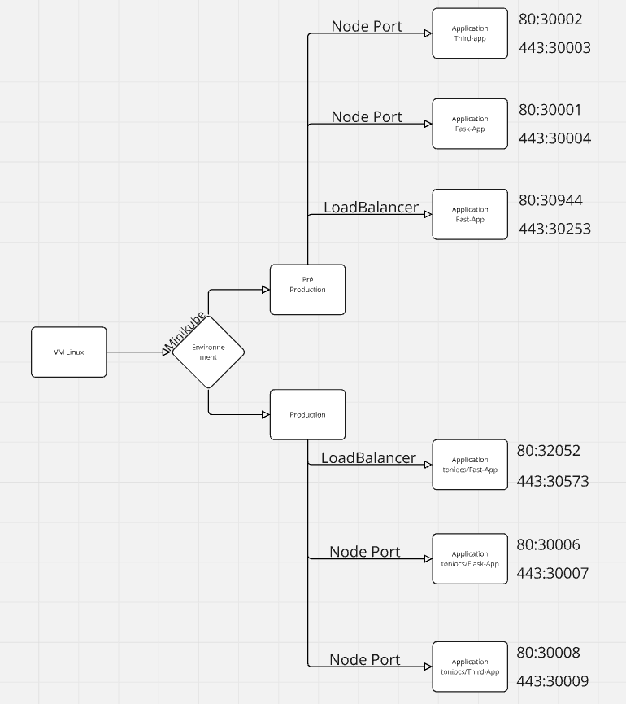
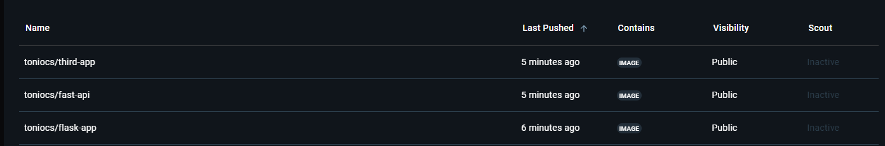

# E5-CISSP
Zenner-Gibeaux Geoffrey Rendu


<!-- PROJECT LOGO --> <br /> <div align="center"> <h3 align="center">Projet Kubernetes : Applications Python</h3> <p align="center"> 


<!-- ABOUT THE PROJECT -->
## Struture du projet

Voici la structure du projet:





 Contenu du Manifest de production

``` yml
# Déploiement pour Flask
apiVersion: apps/v1  # Version de l'API Kubernetes utilisée pour définir un déploiement.
kind: Deployment  # Décrit un objet de type Déploiement, utilisé pour gérer l'état d'une application.
metadata:
  name: flask-app  # Nom unique de ce déploiement, identifiant dans le cluster Kubernetes.
spec:
  selector:
    matchLabels:
      app: flask-app  # Sélectionne les pods ayant le label "app: flask-app".
  template:
    metadata:
      labels:
        app: flask-app  # Labels attribués aux pods créés par ce déploiement.
    spec:
      containers:
      - name: flask-container  # Nom du conteneur pour identifier dans les logs ou métriques.
        image: toniocs/flask-app:prod  # Image Docker utilisée pour le conteneur (version de production).
        imagePullPolicy: Never  # Indique que l'image ne sera pas téléchargée depuis un registre.
        ports:
        - containerPort: 5000  # Port exposé par le conteneur (Flask écoute généralement sur ce port).
---
# Service pour Flask (NodePort)
apiVersion: v1  # Version de l'API pour les services Kubernetes.
kind: Service  # Objet Service pour exposer une application vers l'extérieur.
metadata:
  name: flask-service  # Nom unique pour identifier ce service.
spec:
  type: NodePort  # Type de service permettant un accès depuis un port du nœud.
  selector:
    app: flask-app  # Sélectionne les pods correspondants au déploiement Flask.
  ports:
  - name: http  # Nom logique pour identifier ce port.
    protocol: TCP  # Protocole utilisé.
    port: 80  # Port sur lequel le service sera accessible.
    targetPort: 5000  # Port cible exposé par le conteneur.
    nodePort: 30006  # Port statique utilisé sur le nœud Kubernetes.
  - name: https
    protocol: TCP
    port: 443  # Port sécurisé pour HTTPS.
    targetPort: 8080  # Peut être utilisé pour une future configuration sécurisée.
    nodePort: 30007  # Port statique supplémentaire pour HTTPS.
---
# Déploiement pour FastAPI
apiVersion: apps/v1
kind: Deployment
metadata:
  name: fastapi-app  # Nom du déploiement pour l'application FastAPI.
spec:
  selector:
    matchLabels:
      app: fastapi-app
  template:
    metadata:
      labels:
        app: fastapi-app
    spec:
      containers:
      - name: fastapi-container  # Nom du conteneur pour FastAPI.
        image: toniocs/fast-api:prod  # Image Docker contenant l'application FastAPI.
        imagePullPolicy: Never
        ports:
        - containerPort: 8000  # FastAPI écoute habituellement sur ce port.
---
# Service pour FastAPI (LoadBalancer)
apiVersion: v1
kind: Service
metadata:
  name: fastapi-service
spec:
  type: LoadBalancer  # Service accessible via une IP publique attribuée par le cloud provider.
  selector:
    app: fastapi-app
  ports:
  - name: http
    protocol: TCP
    port: 80
    targetPort: 8000  # Route les requêtes HTTP vers le port de FastAPI.
  - name: https
    protocol: TCP
    port: 443
    targetPort: 8000
---
# Déploiement pour Third-App
apiVersion: apps/v1
kind: Deployment
metadata:
  name: third-app  # Déploiement pour une troisième application (Third-App).
spec:
  selector:
    matchLabels:
      app: third-app
  template:
    metadata:
      labels:
        app: third-app
    spec:
      containers:
      - name: third-app-container  # Conteneur pour Third-App.
        image: toniocs/third-app:prod
        imagePullPolicy: Never
        ports:
        - containerPort: 8080  # Port habituellement utilisé pour une application web.
---
# Service pour Third-App (NodePort)
apiVersion: v1
kind: Service
metadata:
  name: third-app-service
spec:
  type: NodePort
  selector:
    app: third-app
  ports:
  - name: http
    protocol: TCP
    port: 80
    targetPort: 8080
    nodePort: 30008  # Port NodePort exposé pour HTTP.
  - name: https
    protocol: TCP
    port: 443
    targetPort: 8080
    nodePort: 30009  # Port NodePort exposé pour HTTPS.


```

 Contenu du Manifest de préproduction

``` yml
# Déploiement pour Flask
apiVersion: apps/v1
kind: Deployment
metadata:
  name: flask-app
spec:
  selector:
    matchLabels:
      app: flask-app
  template:
    metadata:
      labels:
        app: flask-app
    spec:
      containers:
      - name: flask-container
        image: toniocs/flask-app:preprod
        imagePullPolicy: Never
        ports:
        - containerPort: 5000
---
# Service pour Flask (NodePort)
apiVersion: v1
kind: Service
metadata:
  name: flask-service
spec:
  type: NodePort
  selector:
    app: flask-app
  ports:
  - name: http
    protocol: TCP
    port: 80
    targetPort: 5000
    nodePort: 30001
  - name: https
    protocol: TCP
    port: 443
    targetPort: 8080
    nodePort: 30004
---
# Déploiement pour FastAPI
apiVersion: apps/v1
kind: Deployment
metadata:
  name: fastapi-app
spec:
  selector:
    matchLabels:
      app: fastapi-app
  template:
    metadata:
      labels:
        app: fastapi-app
    spec:
      containers:
      - name: fastapi-container
        image: toniocs/fast-api:preprod
        imagePullPolicy: Never
        ports:
        - containerPort: 8000
---
# Service pour FastAPI (LoadBalancer)
apiVersion: v1
kind: Service
metadata:
  name: fastapi-service
spec:
  type: LoadBalancer
  selector:
    app: fastapi-app
  ports:
  - name: http
    protocol: TCP
    port: 80
    targetPort: 8000
  - name: https
    protocol: TCP
    port: 443
    targetPort: 8000
---
# Déploiement pour Third-App
apiVersion: apps/v1
kind: Deployment
metadata:
  name: third-app
spec:
  selector:
    matchLabels:
      app: third-app
  template:
    metadata:
      labels:
        app: third-app
    spec:
      containers:
      - name: third-app-container
        image: toniocs/third-app:preprod
        imagePullPolicy: Never
        ports:
        - containerPort: 8080
---
# Service pour Third-App (NodePort)
apiVersion: v1
kind: Service
metadata:
  name: third-app-service
spec:
  type: NodePort
  selector:
    app: third-app
  ports:
  - name: http
    protocol: TCP
    port: 80
    targetPort: 8080
    nodePort: 30002
  - name: https
    protocol: TCP
    port: 443
    targetPort: 8080
    nodePort: 30003


```


<!-- GETTING STARTED -->

### Pour déployer les applications:

1- Exécuter la commande suivante pour mettre en place vos application avec le manifest:

``` bash
k apply -f "nom du fichier.yaml" -n "nom du namespace"
```

2- AEt vous pouvez voir vos application déployer en faisant:

``` bash
k get all
```


 Docker Hub repositories



<p align="right"><a href="#readme-top">back to top</a></p>
